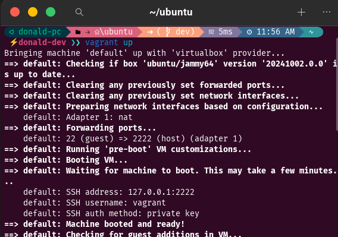

# linux-fundamentals-vagrant

## Show the Vagrant initialization and login process

- Used vagrant up to start the VM and vagrant ssh to spin up the server

## Explore the Linux File System

- Created a directory vagrant using mkdir and used the command cd to move into the created directory.
- Followed the process above to create projects and Devops folders.

## Manage File Permissions and Ownership

- Created a folder named file.
- ls -l to check list of directories or files with details.
- File folder had permision set to -rwxrwxr-x and ownership vagrant.
- Change the permision to -rwxrw-rw- (i.e owner can read, write and execute while the group and general users can only read and write) using chmod 755.
- Created a fakeuser and used the sudo chown file to give the ownership of the folder to fakeuser.

## Install and Configure a Package

## Test Remote Connectivity

### Statistics summary: 3 packets transmitted, 3 received, 0% packet loss, time 2040ms

- Indicates whether the host is reachable.
- 0% packet loss means the connection is stable.
- RTT (round-trip time) stats show network speed and consistency.
